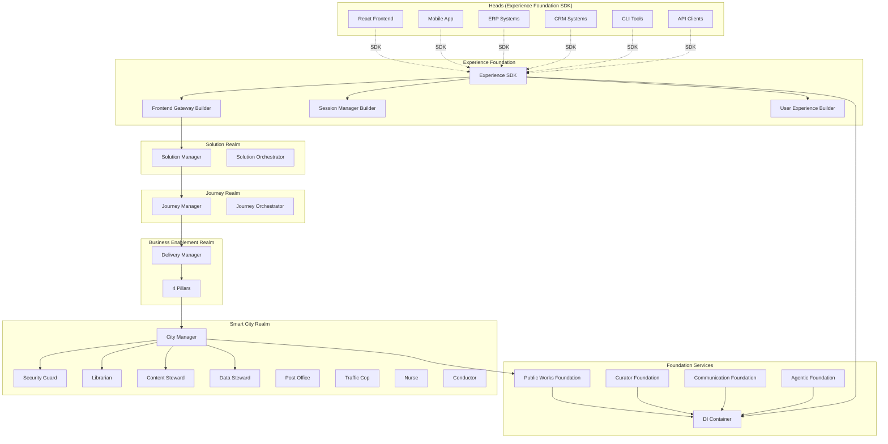
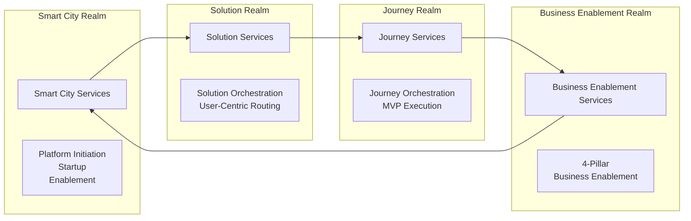
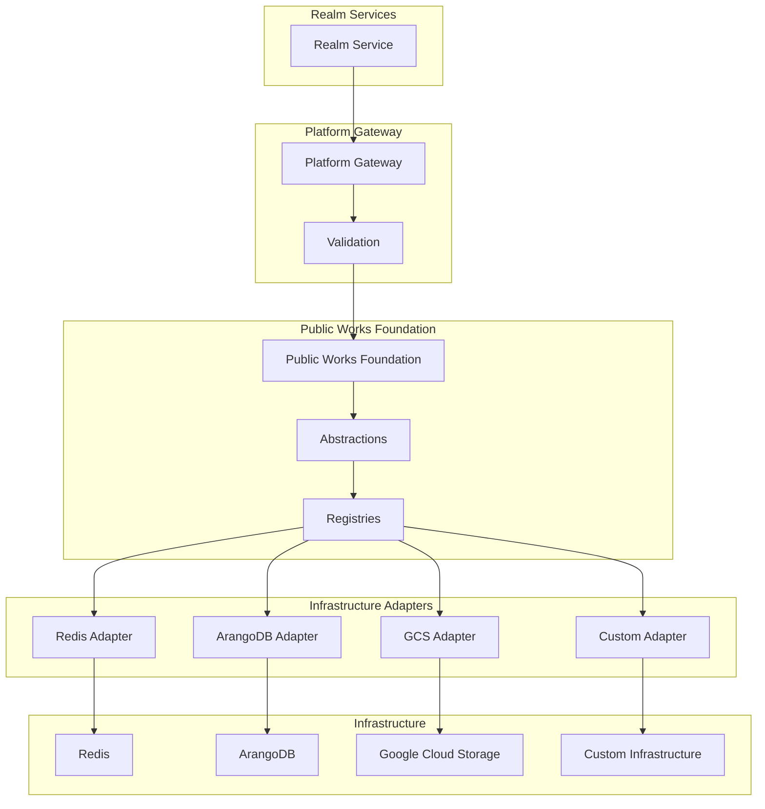
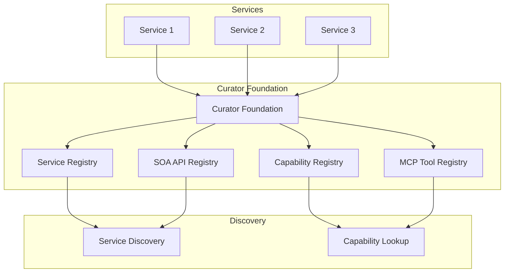
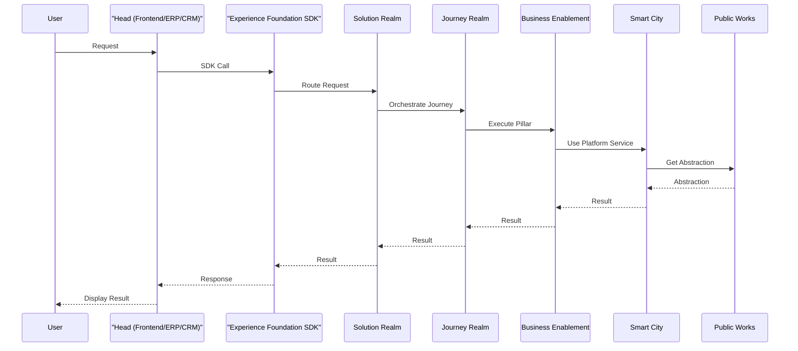
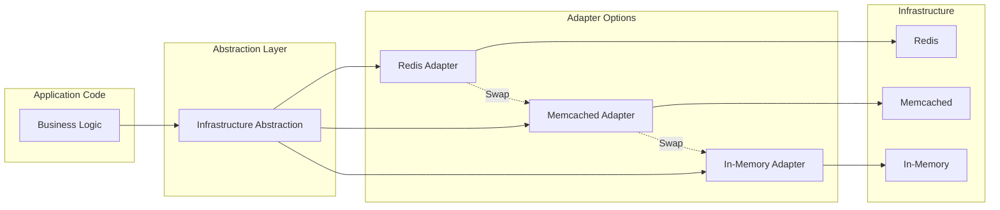
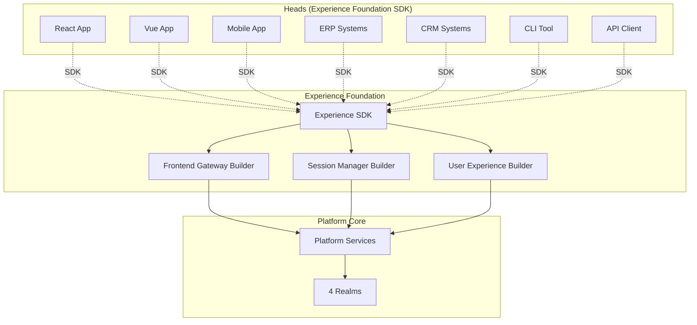

# Architecture Diagrams

This document contains visual architecture diagrams for SymphAIny Platform. Diagrams are created using Mermaid and can be rendered in GitHub, documentation sites, or Mermaid-compatible viewers.

---

## Platform Architecture

---

## Realm Architecture

---

## Infrastructure Abstraction

---

## Service Discovery

---

## Data Flow

---

## Infrastructure Swapping

---

## Headless Architecture (Experience Foundation)

---

**Note**: These diagrams are placeholders. Actual mermaid diagrams should be created based on the current architecture implementation. Diagrams can be rendered in:
- GitHub (native Mermaid support)
- Documentation sites (MkDocs, Docusaurus, etc.)
- Mermaid Live Editor: https://mermaid.live

